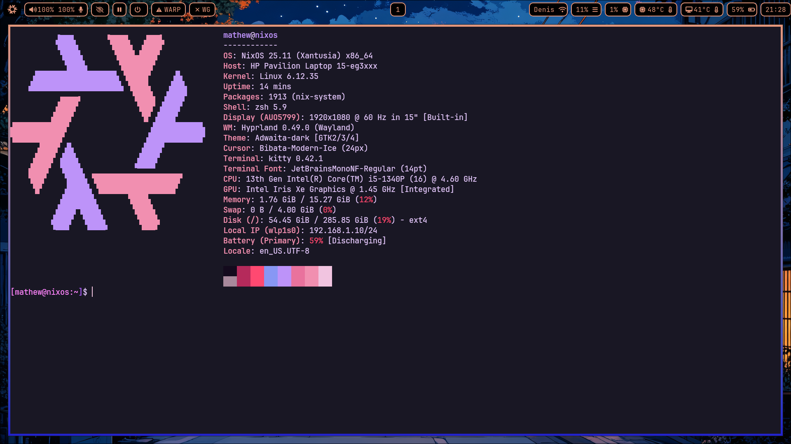

# NixOS Configuration Installer

This repository contains an automated installer script for setting up a personalized NixOS configuration using Nix flakes.

<div align="center">
  
  <br>
  <a href="https://github.com/ChillzonToast">
  
</a>


</div>


## Screenshots


&nbsp;


## Overview

The installer script (`install.lua`) automates the process of:
- Collecting user credentials (username and email)
- Backing up existing hardware configuration
- Copying current hardware configuration to the flake
- Personalizing the configuration with user details
- Applying the NixOS configuration

## Prerequisites

- A working NixOS installation
- Git installed on your system
- Lua interpreter (will be installed via configuration.nix)

## Installation Steps

### 1. Clone this Repository

```bash
git clone <repository-url>
cd nixos-config
```

### 2. Install Lua

First, you need to install Lua using your local configuration.nix. Add Lua to your system packages:

```nix
# In your /etc/nixos/configuration.nix
environment.systemPackages = with pkgs; [
  # ... your existing packages
  lua
];
```

Then rebuild your system:

```bash
sudo nixos-rebuild switch
```

### 3. Run the Installer

Execute the installer script:

```bash
lua install.lua
```

The script will:
1. Prompt for your username
2. Prompt for your email address
3. Create a backup of the existing hardware configuration
4. Copy your current hardware configuration to the flake folder
5. Update all .nix files with your personal information
6. Apply the NixOS configuration using the flake

### 4. Important Warning

⚠️ **CRITICAL**: Do not delete the `nixos-config` folder after running the installer unless you are copying it back to the original configuration location. The flake contains your personalized configuration and hardware settings.

## What the Script Does

The `install.lua` script performs the following operations:

```lua
io.write("Enter your username: ")
local username = io.read()
io.write("Enter your email: ")
local email = io.read()
local flake_folder = os.getenv("HOME") .. "/nixos-config"
local backup_cmd = string.format("cp %s/hardware-configuration.nix %s/hardware-configuration.nix.bak", flake_folder, flake_folder)
os.execute(backup_cmd)
print("Backup of flake's original hardware config created.")
local copy_cmd = string.format("cp /etc/nixos/hardware-configuration.nix %s/hardware-configuration.nix", flake_folder)
print("User's hardware config copied into flake folder.")
os.execute(string.format("sed -i 's/mat-hew-24/%s/g' %s/*.nix", username, flake_folder))
os.execute(string.format("sed -i 's/amonline2005@gmail.com/%s/g' %s/*.nix", email, flake_folder))
print("Username and email updated in flake .nix files.")
-- Step 7: Apply NixOS configuration via flake
print("Applying NixOS configuration from flake...")
os.execute(string.format("sudo nixos-rebuild switch --flake %s", flake_folder))
print("Done! Your nixos-config flake is now updated with user's hardware config.")
```

## Configuration Structure

The repository includes:

- `configuration.nix` - Main NixOS configuration
- `flake.nix` - Nix flake definition
- `hardware-configuration.nix` - Hardware-specific configuration
- `hyprland.conf` - Hyprland window manager configuration
- `home/` - Home Manager configurations
  - `fonts.nix` - Font configurations
  - `home.nix` - Main home configuration
  - `hyprland.nix` - Hyprland-specific home config
  - `programs.nix` - Program configurations
  - `spotify.nix` - Spotify configuration
  - `waybar.nix` - Waybar configuration
  - `wallpaper.png` - Desktop wallpaper
- `rofi/` - Rofi launcher configurations

## Features

This configuration includes:
- Hyprland window manager setup
- Home Manager integration
- Custom Rofi themes
- Waybar status bar
- Font management
- Spotify integration
- Custom wallpaper

## Troubleshooting

### If the script fails:
1. Check that you have proper permissions
2. Ensure Lua is installed correctly
3. Verify that `/etc/nixos/hardware-configuration.nix` exists
4. Make sure the `nixos-config` folder is in your home directory

### Backup Recovery:
If something goes wrong, you can restore the original hardware configuration:
```bash
cp ~/nixos-config/hardware-configuration.nix.bak ~/nixos-config/hardware-configuration.nix
```

## Manual Configuration

If you prefer to configure manually:
1. Copy your hardware configuration: `cp /etc/nixos/hardware-configuration.nix ~/nixos-config/`
2. Edit the .nix files to replace `mat-hew-24` with your username
3. Edit the .nix files to replace `amonline2005@gmail.com` with your email
4. Run: `sudo nixos-rebuild switch --flake ~/nixos-config`

## Support

For issues or questions, please check the configuration files and ensure all dependencies are properly installed.
